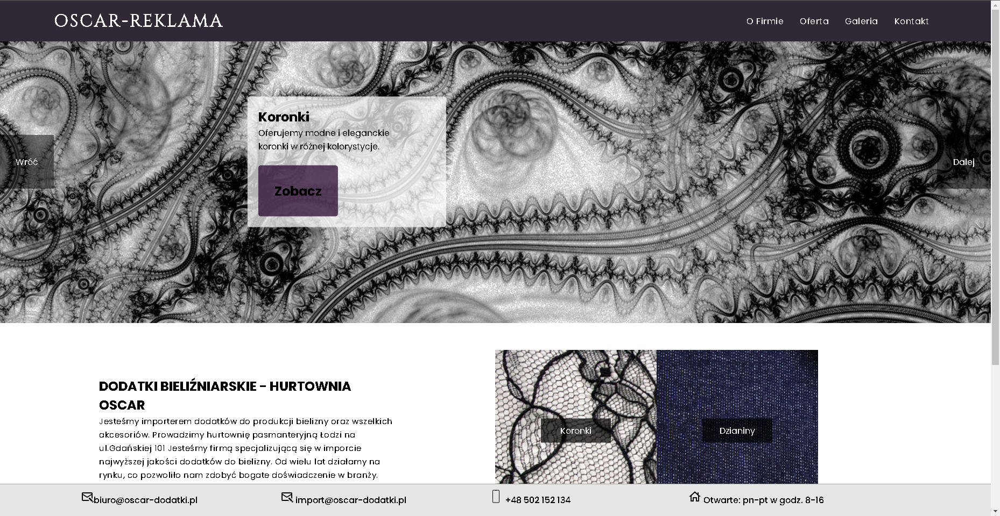

# Wholesale Products Website

## Purpose

The main purpose of this website is to provide a clean, user-friendly interface for customers to browse and purchase products needed for lingerie creation in bulk.

## Technology Stack

The website was built using the following technologies:

- **HTML**: For structuring the content of the website.
- **CSS (Vanilla)**: For styling the website, ensuring it is visually appealing and responsive.
- **JavaScript (Vanilla)**: For adding interactivity and handling user interactions.

## Features

- **Product Catalog**: A comprehensive list of products available for purchase.
- **Responsive Design**: The site is optimized for use on both desktop and mobile devices.
- **User-Friendly Navigation**: Simple and intuitive navigation for easy browsing.

